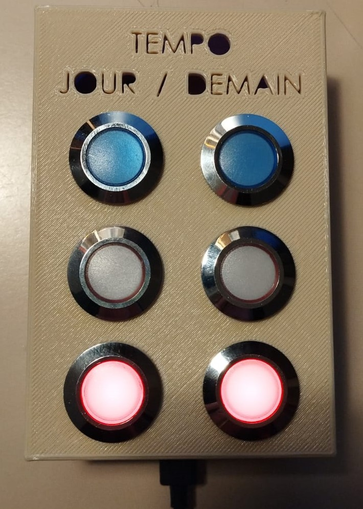

# TempoBox
Boitier connecté pour affichage de la couleur EDF tempo du jour et lendemain

L'objectif du projet est de pouvoir dispopiloter en puissance un appareil, ici le chauffe eau, via des requetes http.
Dans mon cas je l'utilise pour consommer le surplus de puissance généré par mes panneaux photovoltaiques et fonctionner en plus en heures creuses.

Il va falloir 
 - un ESP8266 pour se connecter au réseau et récupérer les infos EDF
<https://fr.aliexpress.com/item/1005002104682197.html?spm=a2g0o.order_list.order_list_main.11.51275e5bm8tN3l&gatewayAdapt=glo2fra>

 - des voyants de couleurs
<https://fr.aliexpress.com/item/1005003993280785.html?spm=a2g0o.order_list.order_list_main.22.46595e5b3iXhu5&gatewayAdapt=glo2fra>
 
 - boitier en impression 3d

	voir dossier /CAD

